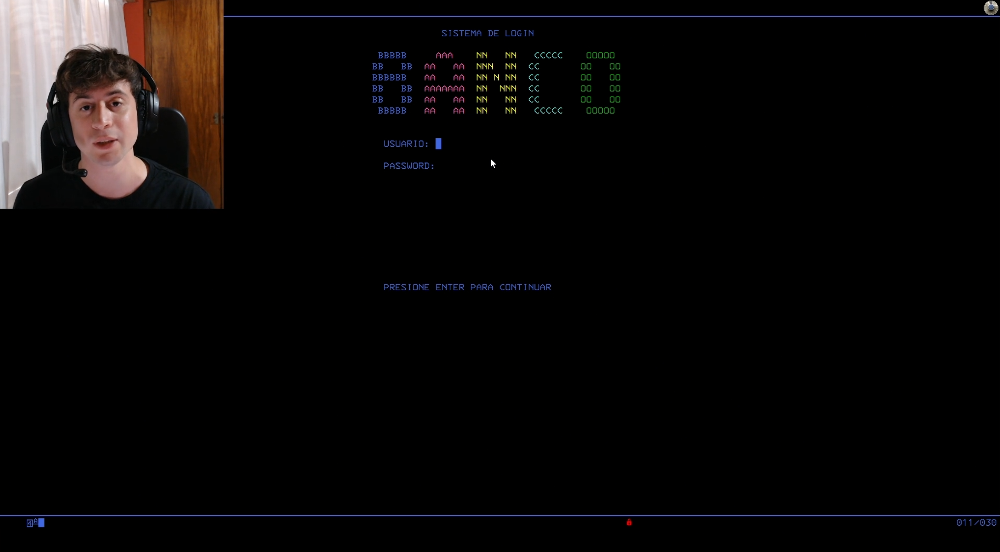
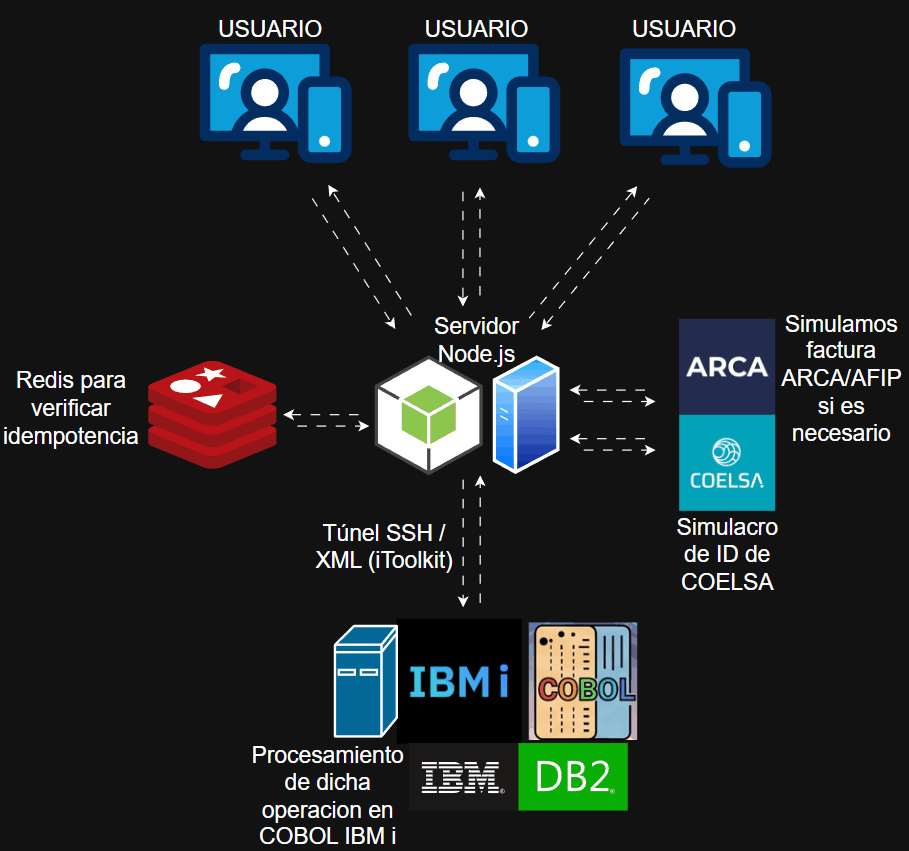

# 🏛️ Core Banking & Interoperability Platform
**De Pantallas Verdes (BMS) a una Arquitectura Bimodal Cloud-Native (Node.js + React + IBM i DB2/COBOL)**


> Un sistema bancario transaccional de misión crítica que demuestra la evolución completa de un **Core Bancario Legacy (CICS/BMS)** hacia un **Ecosistema Moderno**, aplicando el patrón de Arquitectura Bimodal, garantías ACID estrictas y contabilidad de Partida Doble.

---

## 📺 Demostraciones y Evolución del Sistema

### 1. Sistema Tradicional (Terminal 3270 / BMS)
> *Clickea en la imagen para ver el video explicativo original del sistema corriendo en pantallas verdes:*

[](https://youtu.be/YnhqSjVJyWA)

### 2. Arquitectura Moderna (Cloud-Native + AS/400)
> *Flujo de interoperabilidad en tiempo real conectando la interfaz React y el API Gateway en Node.js con el servidor IBM i (AS/400) vía túnel SSH:*



---

## 🚀 La Historia del Proyecto: Evolución de BMS a la Web

El objetivo central de este repositorio es documentar el viaje arquitectónico de **desacoplar una aplicación monolítica de Mainframe** para convertirla en un servicio backend ágil, consumible por interfaces web y móviles modernas, sin sacrificar la seguridad matemática de la contabilidad corporativa.

### 1ª Etapa: El Monolito Pseudoconversacional (CICS/BMS)
El proyecto nació como un sistema bancario tradicional operado mediante terminales 3270 (Pantallas Verdes). 
* **Controlador y Vista:** Gestionados mediante mapas **BMS** y lógica de salto `XCTL`.
* **Optimización CICS:** Implementación de arquitectura **pseudoconversacional** (`RETURN TRANSID` + `COMMAREA`), liberando la memoria del servidor y la tarea entre cada interacción del usuario para lograr máxima escalabilidad.

### 2ª Etapa: El "Core Hueco" y la Capa Anticorrupción (DDD)
En esta segunda parte del proyecto, el código COBOL corre en PUB400. Para conectar el AS/400 a internet sin exponer la base de datos ni saturar el servidor con tráfico basura, se implementó una **Arquitectura Bimodal** basada en Domain-Driven Design (DDD):
1. **Extirpación de la Vista (BMS):** Se reemplazaron los programas de mapa por APIs sin estado (`PBNKTAPI`, `PBNKXAPI`) que reciben y devuelven estructuras alfanuméricas puras por la `LINKAGE SECTION`.
2. **API Gateway en Node.js (Arquitectura Hexagonal):** Actúa como orquestador no bloqueante. Implementa el patrón **Anti-Corruption Layer (ACL)**, traduciendo objetos JSON dinámicos a buffers de ancho fijo EBCDIC y comunicándose con el AS/400 (PUB400) mediante túneles **SSH** e `itoolkit`.
3. **Escudo de Idempotencia en 2 Niveles:** * **Nivel 1 (Memoria RAM - Redis):** Bloquea peticiones HTTP duplicadas en milisegundos (`x-idempotency-key`).
   * **Nivel 2 (Disco Duro - DB2):** Restricción `UNIQUE` en la columna `ID_IDEMPOTENCIA` con captura del código nativo `SQLSTATE 23505` para impedir el "doble gasto" ante caídas de red.

---

## 💼 Arquitectura Contable: Partida Doble y Garantías ACID

A diferencia de un CRUD simple donde el dinero es un campo que se sobrescribe (`UPDATE saldo = saldo - X`), este Core implementa el **Principio Contable de Partida Doble**. Todo evento financiero genera un balance exacto de débitos y créditos que suman cero.

### Estructura Relacional en DB2 (1 a Muchos):
* **Tabla `OPERACION` (Cabecera):** Registra el evento de negocio global (`ID_OPERACION` UUIDv4), la llave de idempotencia y los acuses de recibo fiscales y bancarios externos (`ID_COELSA`, `CAE_AFIP`).
* **Tabla `MOVIMIENTO` (Detalle):** Almacena de 2 a 4 filas por transacción (Débito Origen, Crédito Destino, Comisión e Impuesto IVA). 
  * *Innovación Técnica:* El `ID_MOVIMIENTO` se genera de forma nativa en el motor de DB2 mediante **`HEX(GENERATE_UNIQUE())`**, garantizando unicidad física en texto plano (CHAR 26) sin condiciones de carrera ni secuencias manuales.


### Garantías ACID en DB2:
* **Bloqueo Pesimista (`FOR UPDATE`):** Al validar fondos, COBOL bloquea físicamente la fila del cliente en DB2 para evitar lecturas sucias de transacciones concurrentes.
* **Atomicidad (`COMMIT = *CHG`):** Si cualquier asiento contable falla o el saldo queda en negativo, se ejecuta un **`ROLLBACK`** automático, revirtiendo la transacción sin dejar huérfanos.

---

## 🌐 Enrutamiento Inteligente e Interoperabilidad (Sandbox)

El API Gateway (Node.js) evalúa la longitud del identificador de destino para enrutar los fondos dinámicamente:

1. **Transferencia Interna P2P (Alias / ID 8 caracteres):**
   * Transacción instantánea dentro del ecosistema DB2. Sin comisiones ($0). El IBM i actualiza los saldos locales de Origen y Destino directamente.
2. **Transferencia Externa Interbancaria (CVU / CBU de 22 dígitos):**
   * **Simulador COELSA (Cámara Compensadora):** Node.js valida de forma asíncrona los prefijos oficiales de Argentina (ej: `072` Santander, `00000031` Mercado Pago), simulando latencia de red (300-800ms) y microcortes.
   * **Simulador ARCA / AFIP:** Calcula comisión de servicio ($15.00) e IVA (21% = $3.15), emitiendo un CAE fiscal electrónico de 14 dígitos.
   * **Cuenta Recaudadora Puente:** Para mantener la coherencia de la Partida Doble sin inyectar CVUs externos en la tabla de clientes locales, COBOL desvía los fondos a una cuenta interna de liquidación llamada **`COELSA`**, preservando la trazabilidad de auditoría.

---

## 📂 Estructura del Repositorio

```text
├── 01 - MAINFRAME CORE BMS/        # Versión 1: Sistema original en Pantallas Verdes (CICS/BMS)
│   ├── cbl/                      # Fuentes COBOL (PBNKL, PBNKM, PBNKX, PBNKT, PBNKH)
│   ├── bms/                      # Mapas visuales 3270
│   └── cpy/                      # Copybooks y utilidades de validación numérica
│
├── 02- IBM i APIS/    # Versión 2: Programas COBOL refactorizados como APIs sin estado
│   └── cbl/                      # PBNKTAPI (Partida doble), PBNKXAPI (Caja), PBNKHAPI (Paginación)
│
├── 03 - API GATEWAY NODE/          # Backend Cloud-Native en Node.js (Arquitectura Hexagonal)
│   ├── src/
│   │   ├── config/               # Conexión SSH centralizada (pub400.js)
│   │   ├── controllers/          # Orquestador HTTP (bancoController.js)
│   │   ├── gateways/             # Traductor EBCDIC / XMLSERVICE (cobolGateway.js)
│   │   ├── middlewares/          # Escudo de Idempotencia en Redis
│   │   └── services/             # Simuladores asíncronos (COELSA y ARCA/AFIP)
│   └── server.js                 # Entrypoint Express
│
└── 04 - FRONTEND REACT/            # Interfaz Web SPA en React.js
```
---

## 👨‍💻 Autor

**Martín Rubio** - *Mainframe Developer*
* [LinkedIn](https://www.linkedin.com/in/martin-oscar-rubio-0a0628355/)

---
*Este proyecto fue desarrollado como parte de un portafolio técnico para demostrar competencias avanzadas en el desarrollo de software para el sector bancario/financiero.*
